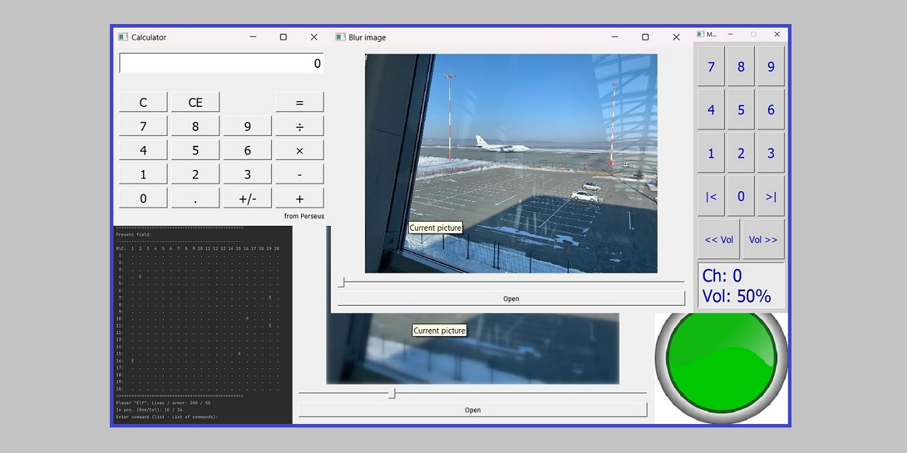

# Учебные проекты (C++)

Здесь выложены, как портфолио, ряд интересных учебных проектов, 
выполненных за время изучения языка C++ "с нуля",
с использованием только изученных, к моменту работы, инструментов, 
содержащих минимальные требования учебных ТЗ
(иногда, по личному желанию - больше :) ).

Проекты выложены в виде файлов (архивов) с исходным кодом, 
выполненным в CLIon или Qt Creator (Community)
и дополнительными файлами (при необходимости). 
Для запуска: файлы отдельной работы разместите в каталог проекта 
IDE (с заменой существующих) и выполните сборку.
Проекты, выполненные в Qt Creator, в другой среде могут потребовать дополнительных настроек.
Работы с графическими интерфейсами используют Qt 5.15.2 (под MinGW) -
требуют, для сборки, установленные библиотеки Qt и соответствующие настройки проекта.

## Состав:
* M39_01_PlayfulCircle (Qt Creator) - динамика состояний в Qt QML;
* M38_03_BlurImg (Qt5) - управляемое наложение "blur"-эффекта на фото;
* M38_01_AudioButton (Qt Creator) - "связь" мультимедиа с элементом управления;
* M37_03_TV_RC (Qt5) - ТВ-пульт - взаимодействие с графическим интерфейсом;
* M37_01_Calculator_Qt (Qt5) - "Калькулятор" - взаимодействие с графическим интерфейсом;
* M33_03_Registry - использование шаблонов в наборах записей;
* M33_02_Fishing - "Рыбалка" - обработка исключений;
* M32_02_JSON_MoveCatalog - "Каталог актеров" из формата Json;
* M31_02_Graphs - наследование в реализации графов;
* M31_01_SmartSharedPtr - класс-аналог std::shared_ptr;
* M30_01_Queries - запросы по сети;
* M29_01_Talents - "Таланты" - кобинации наследования классов;
* M28_03_Kitchen - "Симуляция ресторана" - работа с потоками std::threads;
* M28_02_Trains - "Поезда" - взаимодействие пользовательского ввода и потоков;
* M27_03_Company - "Компания" - иерархия и наследование классов;
* M27_01_Elfs - "Деревня эльфов" - рекурсивная иерархия классов;
* M26_02_Phone - "Мобильник" - работа с классами;
* M26_01_Player - "Плейер" - работа с классами;
* M25_02_CompSim - "Симулятор компьютера" - использование архитектуры проекта;
* M21_04_StepGame - "Бродилка" - небольшой квест;
* M21_03_VectorOperation - операции с векторами;
* M21_02_Village - "Регистр" - цифровое описание поселка;
* M20_04_ATM - "Банкомат" - симулятор банкомата;
* M18_02_03_RabbitJumps - "Прыжки кролика" - рекурсия;
* M16_05_SmartHouse - "Умный дом" - имитация команд и состояний;
* M14_08_SeaBattle - симулятор морского боя.
<H6 align="right">solutions by Perseus</H6>